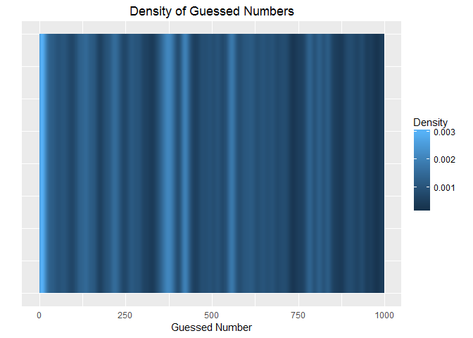
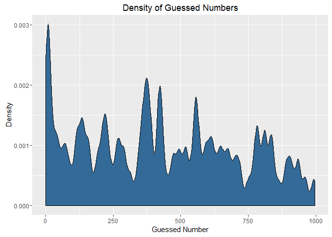

Optimum Guess Calculator for Reddit Random Number Giveaways
================
Paul Foster
5 April 2016

### Overview

Various Reddit giveaway posts involve the poster randomly choosing a number and the commenter who comments the number closest to this is the winner. See [this post](https://www.reddit.com/r/RandomActsOfGaming/comments/4d65cb/giveaway_south_park_the_stick_of_truth_steam_key/) for an example of a giveaway post.

This code is used to calculate the optimal guess by finding the middle of the biggest gap in the guesses. It downloads all the comments, extracts the numbers, plots the density of guesses and outputs the optimum number to guess.

### Inputs

To apply the analysis to any post, simply modify three variables: `MIN_GUESS`, `MAX_GUESS` and `POST_URL`.

``` r
MIN_GUESS <- 0
MAX_GUESS <- 999
POST_URL <- 'https://www.reddit.com/r/RandomActsOfGaming/comments/4d65cb/giveaway_south_park_the_stick_of_truth_steam_key/'
```

### Outputs

<!-- Generate the smoothed data -->
#### 1D Density Plot of the Guessed Numbers

Darker sections indicate larger gaps in guesses.

<!-- -->

#### 2D Density Plot of the Guessed Numbers

Lower points indicate larger gaps in guesses. <!-- -->

#### Optimal Number to Guess

    ## The best new guess that can be made is 976 which covers 12 numbers.
